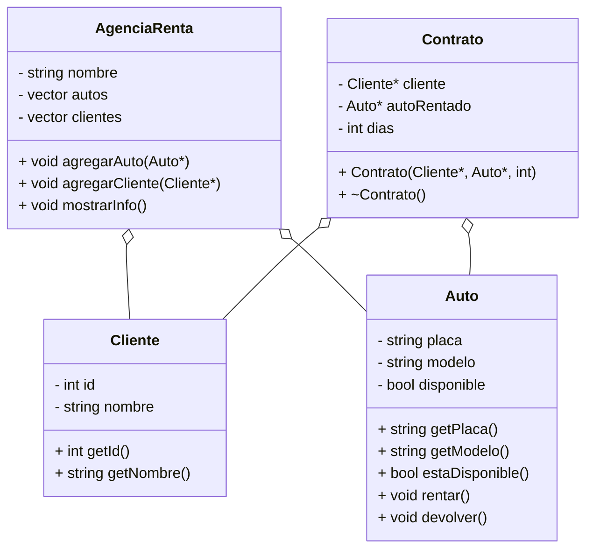

```mermaid
classDiagram
    class Auto {
        - string placa
        - string modelo
        - bool disponible
        + string getPlaca()
        + string getModelo()
        + bool estaDisponible()
        + void rentar()
        + void devolver()
    }

    class Cliente {
        - int id
        - string nombre
        + int getId()
        + string getNombre()
    }

    class Contrato {
        - Cliente* cliente
        - Auto* autoRentado
        - int dias
        + Contrato(Cliente*, Auto*, int)
        + ~Contrato()
    }

    class AgenciaRenta {
        - string nombre
        - vector<Auto*> autos
        - vector<Cliente*> clientes
        + void agregarAuto(Auto*)
        + void agregarCliente(Cliente*)
        + void mostrarInfo()
    }

    AgenciaRenta o-- Auto
    AgenciaRenta o-- Cliente
    Contrato o-- Cliente
    Contrato o-- Auto

```
